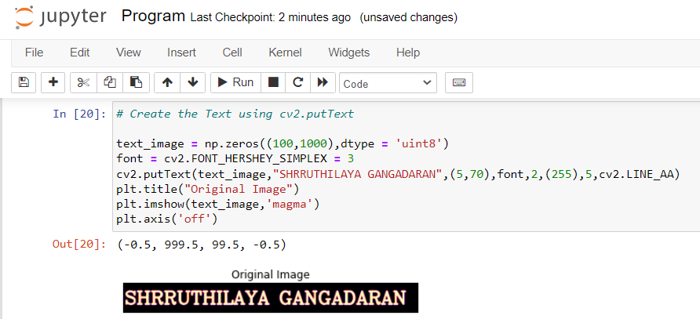

# OPENING-AND-CLOSING

## AIM:
To implement Opening and Closing using Python and OpenCV.

## SOFTWARE REQUIRED:
Anaconda - Python 3.7

OpenCV
## ALGORITHM:
### Step 1:
Import the necessary packages.

### Step 2:
Create the Text using cv2.putText.

### Step 3:
Create the structuring element.

### Step 4:
Use Opening operation.

### Step 5:
Use Closing Operation.

### Step 6:
Print the output and end the program.
## PROGRAM:
Developed by : Shrruthilaya G

Register number : 212221230097
### Import the necessary packages
```python
import cv2
import numpy as np
import matplotlib.pyplot as plt
```
### Create the Text using cv2.putText
```python
text_image = np.zeros((100,1000),dtype = 'uint8')
font = cv2.FONT_HERSHEY_SIMPLEX = 3
cv2.putText(text_image,"SHRRUTHILAYA GANGADARAN",(5,70),font,2,(255),5,cv2.LINE_AA)
plt.title("Original Image")
plt.imshow(text_image,'magma')
plt.axis('off')
```
### Create the structuring element
```python
kernel = cv2.getStructuringElement(cv2.MORPH_CROSS,(7,7))
```

### Use Opening operation
```python
opening_image = cv2.morphologyEx(text_image,cv2.MORPH_OPEN,kernel)
plt.title("Opening")
plt.imshow(opening_image,'magma')
plt.axis('off')
```
### Use Closing Operation
```python
closing_image = cv2.morphologyEx(text_image,cv2.MORPH_CLOSE,kernel)
plt.title("Closing")
plt.imshow(closing_image,'magma')
plt.axis('off')
```

## OUTPUT:

### Input Image


### Result of Opening

### Result of Closing

## RESULT:
Thus, the Opening and Closing operation is used in the image using python and OpenCV.
